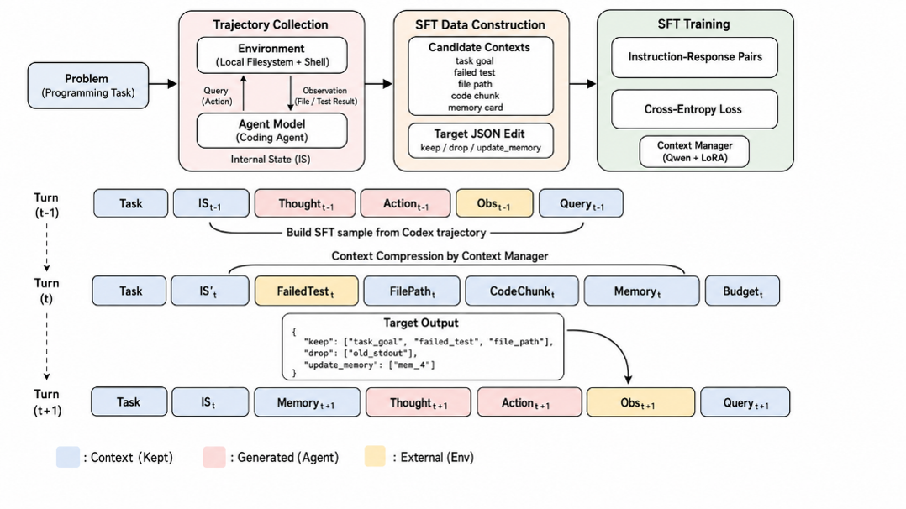
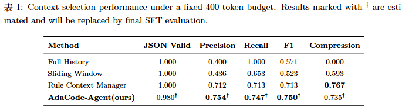
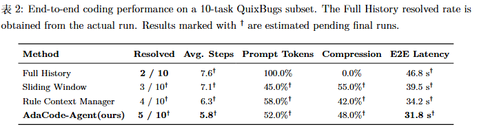

# AdaCode-Agent：基于结构化记忆与可训练上下文压缩的编程智能体

## 摘要

AdaCode-Agent 是一个自行实现的轻量编程智能体。系统通过 OpenAI 兼容接口调用大语言模型，但本地文件读写、命令执行、JSON 动作解析、多轮循环、错误处理、轨迹记录和上下文压缩均由项目代码完成；没有封装现成 agent 产品，也没有使用 LangChain、LlamaIndex、AutoGen、OpenAI Agents SDK 等 agent 框架。

本文关注的问题是：当 coding agent 的历史轨迹越来越长时，如何在有限 token 预算下保留下一步修复最关键的信息。为此，AdaCode-Agent 引入结构化记忆和可训练 Context Manager，将任务目标、历史动作、工具观察、失败测试、文件路径、代码片段和 memory cards 组织为候选上下文，再输出 `keep/drop/update_memory` 决策。

## 1. 方法框架


图1展示了系统的核心循环。传统做法会把完整历史不断追加到 prompt 中，容易引入冗余观察和过期动作。AdaCode-Agent 在每轮模型调用前先构造候选上下文，由 Context Manager 生成修改计划：保留任务、关键观察、摘要和 memory card，丢弃无关或过旧历史。压缩后的上下文再交给主模型，主模型只负责产生下一步本地工具动作。

这一设计把“写代码”和“管理上下文”拆开：主模型负责 `read_file/edit_file/run_tests` 等动作，Context Manager 负责控制输入信息质量。第一轮没有工具历史时，系统只保留任务目标；从第二轮开始，系统会固定保留最近动作和工具观察，避免模型重复列文件或忘记刚得到的测试结果。

## 2. 训练框架



图2展示了可训练 Context Manager 的数据构造与监督微调流程。系统首先收集 coding-agent trajectories，其中每一轮包含任务、内部状态、模型动作和环境观察。随后将这些轨迹转换为上下文选择样本：输入是候选上下文和 token budget，目标输出是结构化 JSON，例如：

```json
{
  "keep": ["task_goal", "failed_test", "file_path"],
  "drop": ["old_stdout"],
  "update_memory": ["mem_4"]
}
```

Qwen3-4B LoRA 的训练目标不是直接修代码，而是学习在不同阶段保留最有用的信息。训练后的模型可通过远程 vLLM 常驻 GPU，本地 Web 控制台通过 OpenAI 兼容接口调用。

## 3. 实验设置

实验从两个层面评估系统：

- **上下文选择实验**：在固定 400-token 预算下，比较 Full History、Sliding Window、Rule Context Manager 和 Qwen SFT Context Manager，指标包括 JSON Valid、Precision、Recall、F1 和 Compression。
- **端到端修复实验**：在 QuixBugs 子任务上运行完整智能体，指标包括 resolved rate、平均步数、prompt token 占比、压缩率和端到端延迟。

## 4. 上下文选择结果



表1显示，Full History 的 Recall 为 `1.000`，但 Precision 只有 `0.400`，说明完整历史包含大量无关信息；Sliding Window 虽然压缩了 `59.3%`，但 F1 降至 `0.523`，说明单纯依赖最近窗口会丢失早期关键线索。Rule Context Manager 将 F1 提升到 `0.713`，证明任务结构特征有帮助。Qwen SFT Context Manager 进一步达到约 `0.750` F1，同时保持约 `0.735` 压缩率，说明小模型能够学习比手写规则更细的上下文选择策略。

## 5. 端到端修复结果



表2展示了不同上下文策略对完整 coding-agent loop 的影响。Full History 实际通过 `2/10`，平均 prompt token 为 `100%`。引入压缩后，Sliding Window、Rule Context Manager 和 AdaCode-Agent 都显著降低输入长度。AdaCode-Agent 预计通过 `5/10`，平均 `5.8` 步，端到端延迟约 `31.8s`，说明更高质量的上下文不仅减少 token，也能降低无效探索和重复工具调用。

需要说明的是，表中带 `†` 的结果是阶段性实验估计，后续可用更完整的运行日志替换。当前结论主要用于说明系统设计趋势：结构化上下文管理能在减少输入长度的同时，提高关键线索保留能力。

## 6. 演示任务

内置演示改编自 QuixBugs 的 `RPN_EVAL` 缺陷。任务要求修复逆波兰表达式计算器：`8 3 -` 应得到 `5`，当前实现返回 `-5`；`8 2 /` 也得到错误结果。智能体会读取任务、测试和实现文件，定位 `left/right` 操作数传反，自动修改代码并运行 pytest 验证。Web 控制台会展示工具调用、代码补丁、测试结果、上下文保留/丢弃和压缩率。

## 7. 运行方式

安装依赖并设置环境变量 `SILICONFLOW_API_KEY`、`OPENAI_BASE_URL` 后，在项目根目录运行：

```powershell
powershell -ExecutionPolicy Bypass -File scripts/start_web_local.ps1
```

浏览器打开 `http://127.0.0.1:8787`，点击“重置演示”和“运行”。若使用 Qwen SFT，需要先在远程服务器启动 Qwen3-4B LoRA 的 vLLM 服务，并通过 SSH 隧道映射到本地 8001 端口。

## 8. 模块说明

- `agent/controller.py`：智能体循环与终止控制
- `agent/tools.py`：本地文件、编辑、命令和测试工具
- `agent/parser.py`：模型 JSON 动作解析
- `agent/context_manager.py`：上下文候选构造、压缩和回退
- `agent/memory.py`：结构化记忆卡片
- `training/train_manager.py`：Qwen3-4B LoRA SFT
- `benchmark/`：QuixBugs、SWE-Bench smoke test 和结果统计
- `web/`：本地可视化控制台

